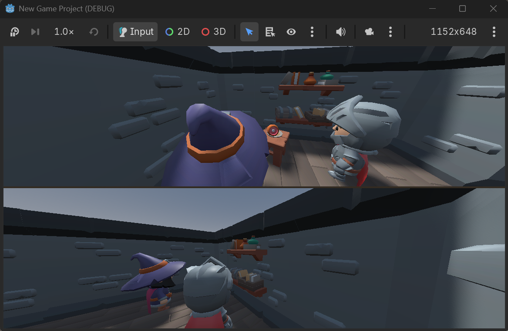

<style>
@import url('https://fonts.googleapis.com/css2?family=Cinzel:wght@400;600;700&family=Jost:wght@300;400;500;600&family=JetBrains+Mono:wght@400&display=swap');

:root {
  --vl-bg-0: #080a0f;
  --vl-bg-1: #0d1016;
  --vl-bg-2: #161b26;
  --vl-stone: #1c2230;
  --vl-line: rgba(154, 160, 177, 0.22);

  --vl-bone: #ece4cf;
  --vl-ash: #9aa0b1;
  --vl-emerald: #5ef29b;
  --vl-amber: #ffb15e;
  --vl-rune: #5bc8ff;

  --color-background: var(--vl-bg-1);
  --color-foreground: var(--vl-bone);
  --color-highlight: var(--vl-emerald);
  --color-dimmed: var(--vl-ash);
  --color-muted: #141924;
  --color-header: var(--vl-bone);
  --color-footer: var(--vl-ash);
  --color-link: var(--vl-emerald);
  --color-accent: var(--vl-amber);

  --font-heading: 'Cinzel', Georgia, 'Times New Roman', serif;
  --font-body: 'Jost', 'Segoe UI', system-ui, sans-serif;
  --font-mono: 'JetBrains Mono', 'Fira Code', ui-monospace, monospace;
}

section {
  position: relative;
  font-family: var(--font-body);
  font-weight: 300;
  color: var(--vl-bone);

  background:
    radial-gradient(
      130% 90% at 12% -8%,
      rgba(91, 200, 255, 0.10),
      transparent 55%
    ),
    radial-gradient(
      120% 90% at 90% 112%,
      rgba(94, 242, 155, 0.08),
      transparent 50%
    ),
    radial-gradient(
      80% 55% at 88% 10%,
      rgba(255, 177, 94, 0.10),
      transparent 55%
    ),
    repeating-linear-gradient(
      0deg,
      rgba(255, 255, 255, 0.014) 0 1px,
      transparent 1px 96px
    ),
    repeating-linear-gradient(
      90deg,
      rgba(255, 255, 255, 0.014) 0 1px,
      transparent 1px 96px
    ),
    linear-gradient(
      168deg,
      var(--vl-bg-2) 0%,
      var(--vl-bg-1) 55%,
      var(--vl-bg-0) 100%
    );

  box-shadow: inset 0 0 200px 30px rgba(0, 0, 0, 0.72);
}

section::before {
  content: '✦';
  position: absolute;
  right: 3.5%;
  bottom: 3%;
  font-size: 9rem;
  line-height: 1;
  color: rgba(94, 242, 155, 0.045);
  pointer-events: none;
  user-select: none;
}

h1,
h2,
h3,
h4,
h5,
h6 {
  font-family: var(--font-heading);
  font-weight: 600;
  color: var(--vl-bone);
  letter-spacing: 0.04em;
}

h1 {
  font-size: 2.1rem;
  margin-bottom: 0.35em;
  text-shadow: 0 0 28px rgba(94, 242, 155, 0.28);
}

h2 {
  font-size: 1.5rem;
  margin-bottom: 0.7em;
}

h2::before {
  content: '✦';
  margin-right: 0.35em;
  font-size: 0.72em;
  color: var(--vl-amber);
  text-shadow: 0 0 10px rgba(255, 177, 94, 0.6);
}

h2::after {
  content: '';
  display: block;
  width: 3em;
  height: 2px;
  margin-top: 0.4em;
  border-radius: 999px;
  background: linear-gradient(
    90deg,
    var(--vl-emerald),
    var(--vl-amber)
  );
  box-shadow: 0 0 10px rgba(94, 242, 155, 0.55);
}

h3 {
  font-size: 1.15rem;
  color: var(--vl-emerald);
}

p {
  line-height: 1.6;
  margin: 0.4em 0;
}

strong {
  color: var(--vl-emerald);
  font-weight: 500;
}

em {
  color: var(--vl-amber);
}

a {
  color: var(--vl-rune);
  text-decoration: none;
  border-bottom: 1px dotted rgba(91, 200, 255, 0.5);
}

ul {
  list-style: none;
  padding-left: 0.2em;
}

ul li {
  position: relative;
  padding-left: 1.2em;
  margin: 0.4em 0;
}

ul li::before {
  content: '◆';
  position: absolute;
  left: 0;
  top: 0.06em;
  font-size: 0.72em;
  color: var(--vl-emerald);
  text-shadow: 0 0 8px rgba(94, 242, 155, 0.7);
}

ol {
  padding-left: 1.4em;
}

ol li::marker {
  color: var(--vl-amber);
  font-weight: 600;
  font-family: var(--font-heading);
}

blockquote {
  border-left: 3px solid var(--vl-amber);
  background: rgba(255, 177, 94, 0.06);
  padding: 0.4em 1em;
  border-radius: 0 8px 8px 0;
  color: var(--vl-ash);
}

pre {
  font-family: var(--font-mono);
  font-size: 0.85rem;
  line-height: 1.6;
  color: var(--vl-bone);

  background:
    radial-gradient(
      120% 120% at 0% 0%,
      rgba(91, 200, 255, 0.07),
      transparent 60%
    ),
    #090b10;

  border: 1px solid rgba(94, 242, 155, 0.28);
  border-radius: 12px;
  box-shadow: 0 0 34px rgba(94, 242, 155, 0.08);
  padding: 1em 1.3em;
  overflow: hidden;
}

pre code,
code.hljs,
.hljs {
  color: var(--vl-bone);
  background: transparent;
}

.hljs-comment,
.hljs-quote {
  color: var(--vl-ash);
  font-style: italic;
}

.hljs-keyword,
.hljs-selector-tag,
.hljs-built_in,
.hljs-name {
  color: var(--vl-rune);
}

.hljs-string,
.hljs-regexp,
.hljs-addition {
  color: var(--vl-emerald);
}

.hljs-number,
.hljs-literal,
.hljs-title,
.hljs-section {
  color: var(--vl-amber);
}

:not(pre) > code {
  font-family: var(--font-mono);
  font-size: 0.85em;
  background: rgba(91, 200, 255, 0.12);
  color: var(--vl-rune);
  border-radius: 5px;
  padding: 0.08em 0.35em;
}

table {
  border-collapse: separate;
  border-spacing: 0;
  width: 100%;
  font-size: 0.92rem;
  margin: 0.8em 0;
  border-radius: 10px;
  overflow: hidden;
  background: #10141d !important;
  border: 1px solid var(--vl-line);
  box-shadow: 0 4px 22px rgba(0, 0, 0, 0.45);
}

thead,
tbody,
tr {
  background: #10141d !important;
}

th {
  font-family: var(--font-heading);
  font-size: 0.76rem;
  letter-spacing: 0.08em;
  text-transform: uppercase;
  text-align: left;

  color: var(--vl-amber) !important;
  background: rgba(255, 177, 94, 0.14) !important;

  border-bottom: 2px solid rgba(255, 177, 94, 0.45);
  padding: 0.6em 0.9em;
}

td {
  color: var(--vl-bone) !important;
  background: #10141d !important;

  border-bottom: 1px solid var(--vl-line);
  padding: 0.6em 0.9em;
  vertical-align: top;
  line-height: 1.5;
}

tbody tr:nth-child(even),
tbody tr:nth-child(even) td {
  background: #161b26 !important;
}

tbody tr:last-child td {
  border-bottom: none;
}

img {
  border-radius: 10px;
  box-shadow:
    0 0 0 1px rgba(154, 160, 177, 0.35),
    0 0 40px rgba(94, 242, 155, 0.08),
    0 12px 36px rgba(0, 0, 0, 0.65);
}

header,
footer {
  font-size: 0.6rem;
  letter-spacing: 0.06em;
  color: var(--vl-ash);
}

section::after {
  content: '◆ ' attr(data-marpit-pagination);
  position: absolute;
  right: 30px;
  bottom: 20px;

  font-family: var(--font-heading);
  font-size: 0.62rem;
  letter-spacing: 0.08em;
  color: var(--vl-ash);
}

section.lead {
  text-align: center;
}

section.lead h1,
section.lead h2 {
  margin-bottom: 0.25em;
}

section.lead h1 {
  font-size: 3.2rem;
  letter-spacing: 0.1em;

  text-shadow:
    0 0 34px rgba(94, 242, 155, 0.45),
    0 0 90px rgba(94, 242, 155, 0.2);
}

section.lead h2::after {
  margin-left: auto;
  margin-right: auto;
}

section.lead p {
  color: var(--vl-ash);
  font-size: 1.05rem;
  max-width: 62%;
  margin-left: auto;
  margin-right: auto;
}

section.lead p:first-of-type {
  color: var(--vl-amber);
  font-size: 1.2rem;
}

section.lead::after {
  display: none;
}
</style>

<!-- _class: lead -->

# Virelune

A two-player cooperative dungeon-crawling game controlled by custom physical controllers

**Exploring how physical controllers can make cooperative gameplay more interactive and personal.**

Emily Young · Senior Project · Fall 2026

---

## What is Virelune?

A two-player local cooperative dungeon crawler built around **custom physical controllers**.

- Developed in **Godot** and controlled through **Arduino**
- Combines game development, hardware, and HCI
- Designed as a small but polished playable prototype

---

## Main Features

- Two-player local cooperative gameplay
- Character-specific abilities and controls
- Dungeon exploration and enemy combat
- Environmental puzzles requiring cooperation
- Final boss encounter
- Custom physical controller integration

---

## Custom Physical Controllers

- One purpose-built controller per player
- Arduino-compatible microcontroller reads **joysticks and buttons**
- Communicates over **serial** using controller ID, joystick position, and button states
- The controller is part of the game — not just a keyboard replacement

---

## Related Work & Inspiration

| Solution           | What Virelune takes from it            |
| ------------------ | -------------------------------------- |
| Minecraft Dungeons | Cooperative dungeon-crawling structure |
| Nintendo Labo      | Physical interface as part of gameplay |
| Makey Makey        | Physical objects as computer input     |

---

## Technologies

- **Godot** — game engine for 3D gameplay, physics, animation, audio, and UI
- **GDScript** — Python-like scripting language used for gameplay logic
- **Arduino** — inexpensive platform for reading custom physical inputs
- **Serial communication** — direct connection between the controllers and the game

---

## System Architecture

```text
[ Player 1 Controller ] ──── serial ────┐
                                       ▼
                                ┌──────────────┐
                                │   Virelune   │
                                │   (Godot)    │
                                │ P1 · P2      │
                                │ Enemies/Boss │
                                └──────────────┘
                                       ▲
[ Player 2 Controller ] ──── serial ────┘
```

Two players, one game instance — no networking needed.

---

## Why Godot?

- **Lightweight** — appropriate for a small, focused project
- **Built-in systems** — physics, animation, audio, UI, and 3D support
- **Familiar scripting** — GDScript has Python-like syntax
- **Project fit** — provides the tools I need without the additional complexity of Unity

---

## Project Challenges

- Reliable, responsive controller-to-game integration
- Cooperative mechanics where **both players matter**
- Controllers that feel different but work as a team
- Keeping scope small — one dungeon, limited enemies, one boss

---

## Scope

- **Small, polished prototype** over lots of content
- One dungeon · limited enemies · small ability set · one boss
- Complete pipeline: physical input → in-game action

---

## Early Prototype



---

<!-- _class: lead -->

## Thank You

Questions?