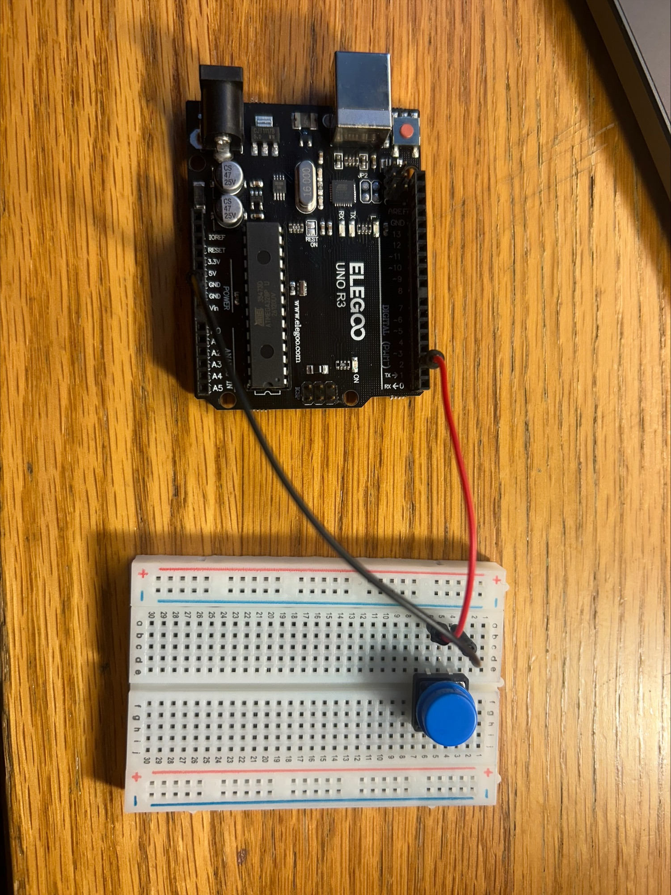

# 2. Arduino Setup

Before any wiring happens, it helps to understand what we are actually doing. This part
covers:

- What **serial communication** is and why a USB cable can carry it.
- How to wire a **push button** (digital input) to the Arduino.
- How to wire a **potentiometer** (analog input) to the Arduino.

You will not write a full program yet — that is [Part 3](03-sending-serial-data.md).
Here we focus on the hardware and the concepts behind it.

## 2.1 What is serial communication?

**Serial communication** is a way of sending data between two devices one bit at a time,
over a single wire (or a small pair of wires). "Serial" means the data is sent in a
sequence — one after another — rather than all at once on many parallel wires.

Think of it like talking on a phone line: both sides agree on a speed and a format, and
then one side speaks while the other listens. For the Arduino, the message is just text,
like `BUTTON:1` or `POT:512`.

The key rules both sides must agree on are:

- **Baud rate:** how fast the bits are sent. We use **9600** bits per second, which is the
  classic default. Both the Arduino and the computer must use the same number.
- **Line endings:** a signal that a message is finished. We use a newline (`\n`), which is
  what `Serial.println()` adds automatically.

## 2.2 Why can a USB cable carry serial data?

The Arduino Uno has a small chip on the board that converts the Arduino's serial signal
into **USB**, and back again. This means the USB cable that powers the board is the same
cable we use to send data. The computer sees the Arduino as a **serial port** with a name
like:

- `COM3` or `COM5` on Windows
- `/dev/tty.usbmodemXXXX` on macOS
- `/dev/ttyACM0` or `/dev/ttyUSB0` on Linux

That port name is important. Later, in [Part 4](04-connecting-godot.md), Godot needs to
know exactly which port to open. The port name can be different on different computers, so
we will show you how to find yours.

## 2.3 Parts you need for this part

- Arduino Uno (or compatible) and USB cable
- 1 push button
- 1 potentiometer (10 kΩ)
- 1 breadboard
- Several jumper wires

## 2.4 Breadboard basics

A breadboard lets you connect components without soldering. The two long rows on the
sides (often marked `+` and `-`) are the **power rails** — they run the whole length of
the board. The pins in the middle are connected in short vertical strips of five holes.

The rule that matters most here: **each vertical strip of five holes is all connected
together**. Two wires pushed into the same vertical strip are electrically connected.

> **Note:** When a part has legs that go into two different vertical strips (like a
> potentiometer, which has three legs), the legs are *not* connected to each other
> directly — the component itself connects them internally.

## 2.5 Wiring the push button (digital input)

The button is our **digital input**. A digital pin reads only two values: `HIGH` (5 V, or
"on") and `LOW` (0 V, or "off").

To keep things simple and avoid extra parts, we use the Arduino's built-in **pull-up
resistor**. That means the pin reads `HIGH` by default. When you press the button, it
connects the pin to ground, so the pin reads `LOW`.

> **Warning:** This is a common point of confusion. With a pull-up resistor, "pressed"
> reads `LOW`, and "not pressed" reads `HIGH`. It seems backwards at first, but the
> Arduino code in Part 3 handles it for you. See the official
> [digitalRead() documentation](https://docs.arduino.cc/language-reference/en/functions/digital-io/digitalread)
> and the
> [InputPullupSerial example](https://docs.arduino.cc/built-in-examples/digital/InputPullupSerial)
> for more detail.

### Connections

1. Push the button into the middle of the breadboard so that its four legs straddle the
   center gap.
2. Connect **one leg** of the button to the `GND` pin on the Arduino with a jumper wire.
3. Connect the **leg on the opposite side** of the button to digital pin **2** on the
   Arduino.

> **Tip:** On a typical 4-pin push button, the two pins on one side are connected
> internally. If pressing the button does not change the reading later, rotate the button
> 90° in the breadboard. The exact pins don't matter — what matters is that one side goes
> to GND and the other side goes to pin 2.

## 2.6 Wiring the potentiometer (analog input)

The potentiometer is our **analog input**. An analog pin can read a *range* of values,
not just on/off. On an Arduino Uno, `analogRead()` returns a value from **0** to **1023**
based on the voltage at the pin.

A potentiometer is essentially a voltage divider: it has a fixed resistor with a movable
"wiper" in the middle. Turning the knob moves that wiper, which changes the voltage
measured at the middle pin.

### Connections

1. Connect the **left outer pin** of the potentiometer to `GND` on the Arduino.
2. Connect the **right outer pin** to `5V` on the Arduino.
3. Connect the **middle pin** to analog pin **A0** on the Arduino.

> **Tip:** If your potentiometer has an uneven resistance curve, don't worry. The exact
> pin order (GND vs. 5V) only affects which direction the value changes when you turn the
> knob. If the value goes down when you turn right instead of up, swap the two outer
> wires.

Read the official
[analogRead() documentation](https://docs.arduino.cc/language-reference/en/functions/analog-io/analogRead)
if you want the full details on how the 0–1023 range works.

## 2.7 Install the Arduino IDE

If you do not have the Arduino IDE yet:

1. Go to [arduino.cc/en/software](https://www.arduino.cc/en/software).
2. Download the version for your operating system (the classic **Arduino IDE 2.x**).
3. Install it like any other program.
4. Connect the Arduino to your computer with the USB cable.

## 2.8 Check your board and port in the IDE

Open the Arduino IDE. Before we can upload code, the IDE needs to know two things: which
**board** you have and which **port** it is on.

1. Go to **Tools > Board** and select **Arduino AVR Boards > Arduino Uno** (or your exact
   board).
2. Go to **Tools > Port** and select the port that lists your Arduino. On Windows this is
   usually `COM3` or similar; on Linux it is `/dev/ttyACM0` or `/dev/ttyUSB0`; on macOS it
   is `/dev/tty.usbmodemXXXX`.
3. Note the **exact port name** somewhere — you will need it in Part 4.

> **Note:** If no port appears, the USB driver may not be installed, or the cable may be
> "charge only" (some cheap USB cables cannot carry data). Try another cable. This is the
> single most common problem at this stage.

Now that the hardware is wired and the IDE is ready, let's write the Arduino program that
reads the button and knob, and verify the messages arrive in the **Serial Monitor**. That
is [Part 3: Sending Serial Data](03-sending-serial-data.md).

---

**Previous:** [1. Introduction](01-introduction.md) | **Next:** [3. Sending Serial Data](03-sending-serial-data.md)