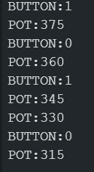

# 3. Sending Serial Data

In this part you will write the Arduino program, upload it to the board, and watch the
board send messages in the **Serial Monitor**. This is where the hardware from
[Part 2](02-arduino-setup.md) becomes a working "controller" that produces data.

## 3.1 The message protocol

The Arduino and Godot need to agree on what the messages look like. This agreement is
called a **protocol**. Our protocol is deliberately simple: one **label**, a colon, and a
**value**, one message per line.

```text
BUTTON:1     (button pressed)
BUTTON:0     (button released)
POT:512      (potentiometer value, 0 to 1023)
```

Why this format?

- **One message per line.** `Serial.println()` ends every line with a newline, and Godot's
  line-buffered mode uses that newline to know when one message ends.
- **A label we can match on.** Godot can check `if (text.begins_with("BUTTON:"))` and
  decide what to do with it.
- **A value after the colon.** Godot splits the message on `:` and reads the number.

This is exactly the same idea behind Virelune's protocol: the game and the controller
agree on a set of labels, and the Arduino sends them continuously.

## 3.2 The full Arduino program

Create a new sketch in the Arduino IDE (**File > New**), paste the code below, and save it
with any name you like (for example `serial_controller`).

```cpp
// serial_controller.ino
// Reads one push button (digital) and one potentiometer (analog)
// and sends their values to the computer over USB serial.

const int BUTTON_PIN = 2;   // button connected to digital pin 2
const int POT_PIN = A0;     // potentiometer middle pin to analog pin A0

int lastButtonState = HIGH; // pull-up means "released" reads HIGH
int lastPotValue = -1;      // force the first POT message to be sent

void setup() {
  // Start serial at 9600 bits per second.
  Serial.begin(9600);

  // Use the built-in pull-up resistor so the button reads HIGH
  // when released and LOW when pressed.
  pinMode(BUTTON_PIN, INPUT_PULLUP);
}

void loop() {
  // ---------- Read the button (digital input) ----------
  int buttonState = digitalRead(BUTTON_PIN);

  // Only send a message when the button state *changes*.
  // This avoids flooding the serial line with repeated messages.
  if (buttonState != lastButtonState) {
    if (buttonState == LOW) {
      Serial.println("BUTTON:1");  // pressed
    } else {
      Serial.println("BUTTON:0");  // released
    }
    lastButtonState = buttonState;
  }

  // ---------- Read the potentiometer (analog input) ----------
  int potValue = analogRead(POT_PIN);

  // Only send when the value changed by a small amount.
  // The knob is slightly noisy, so this prevents jitter.
  if (abs(potValue - lastPotValue) > 2) {
    Serial.print("POT:");
    Serial.println(potValue);
    lastPotValue = potValue;
  }

  // Give the serial connection a little breathing room.
  delay(10);
}
```

## 3.3 What each important part does

### `const int BUTTON_PIN = 2;`

`const` means the value never changes. We name the pin so the rest of the code is easy to
read. If you rewired the button to pin 3, you would only change this one line.

### `Serial.begin(9600);`

Starts the serial connection at **9600 baud** (bits per second). This must match the baud
rate Godot uses later. See the official
[Serial.begin() documentation](https://docs.arduino.cc/language-reference/en/functions/communication/serial/begin).

### `pinMode(BUTTON_PIN, INPUT_PULLUP);`

Tells the Arduino that pin 2 is an *input* and to enable the internal pull-up resistor.
Because of the pull-up, the pin reads `HIGH` normally and `LOW` when the button connects
it to ground. See the official
[INPUT_PULLUP documentation](https://docs.arduino.cc/language-reference/en/variables/constants/inputOutputPullup).

### `digitalRead(BUTTON_PIN)`

Reads the button. Returns `HIGH` (1) or `LOW` (0). We check if the state *changed* since
the last loop, so the button sends `BUTTON:1` exactly once per press and `BUTTON:0` once
per release. This is called **edge detection**. See the official
[digitalRead() documentation](https://docs.arduino.cc/language-reference/en/functions/digital-io/digitalread).

### `analogRead(POT_PIN)`

Reads the potentiometer. Returns an integer from **0 to 1023** depending on the knob
position. See the official
[analogRead() documentation](https://docs.arduino.cc/language-reference/en/functions/analog-io/analogRead).

### `abs(potValue - lastPotValue) > 2`

The knob is slightly noisy — the same position can read 512 one moment and 513 the next.
Sending every tiny fluctuation would flood the serial line with near-identical messages.
By only sending when the value changes by more than 2, we get clean, readable output.

### `Serial.print()` vs `Serial.println()`

- `Serial.print("POT:")` prints text with **no** line ending.
- `Serial.println(potValue)` prints the number and then a **newline**.

Together they produce `POT:512\n`. See the
[Serial.print()](https://docs.arduino.cc/language-reference/en/functions/communication/serial/print)
and
[Serial.println()](https://docs.arduino.cc/language-reference/en/functions/communication/serial/println)
documentation for details.

## 3.4 Upload the program

1. Make sure the Arduino is plugged in.
2. In the Arduino IDE, verify **Tools > Board** and **Tools > Port** are correct (from
   [Part 2](02-arduino-setup.md#28-check-your-board-and-port-in-the-ide)).
3. Click the **Upload** button (the right-pointing arrow in the toolbar).
4. Wait for "Uploading..." to finish. The board's TX/RX LEDs will blink.

> **Note:** When you upload a new program, the board briefly resets and the serial port
> reconnects. If you later try to open the port in Godot right after an upload, wait a
> couple of seconds first.

## 3.5 Verify the data in the Serial Monitor

The **Serial Monitor** is the Arduino IDE's built-in tool for showing whatever the
Arduino sends over serial.

1. Click the **Serial Monitor** icon in the top-right corner of the IDE (looks like a
   magnifying glass).
2. In the Serial Monitor window, set the baud rate dropdown to **9600**.
3. Press the button and turn the knob.

You should see something like:

```text
POT:512
POT:645
BUTTON:1
BUTTON:0
POT:501
POT:320
```

When you press the button you should see `BUTTON:1` followed by `BUTTON:0` when you
release it. When you turn the knob, `POT:` messages with changing numbers should appear.



## 3.6 Troubleshooting

| Problem | Likely fix |
|---------|------------|
| No messages appear | Check the baud rate is **9600** in the Serial Monitor |
| `BUTTON:` never shows | Check the button wiring: one side to GND, other side to pin 2 |
| `POT:` stuck at 0 or 1023 | Check the potentiometer's outer pins are on GND and 5V |
| Garbage characters | The baud rate on one side doesn't match the other |

## 3.7 Checklist before continuing

- [ ] I see `BUTTON:1` / `BUTTON:0` when I press and release the button.
- [ ] I see `POT:<number>` that changes when I turn the knob.
- [ ] I know the serial port name (e.g. `COM5`, `/dev/ttyACM0`).

Once all three are true, the Arduino side is done. Now we switch to Godot and build the
other half of the system in [Part 4: Connecting Godot](04-connecting-godot.md).

---

**Previous:** [2. Arduino Setup](02-arduino-setup.md) | **Next:** [4. Connecting Godot](04-connecting-godot.md)