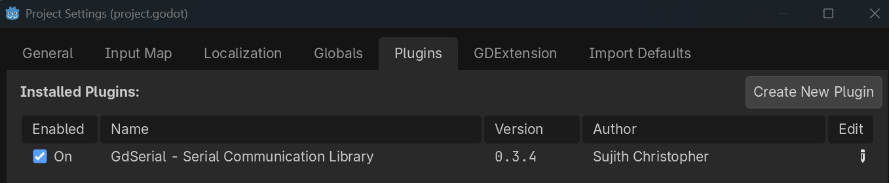

# 4. Connecting Godot

Now that the Arduino is sending `BUTTON:` and `POT:` messages, we build the Godot side.
This part covers:

- Creating a Godot project.
- Installing the **GdSerial** addon (the same one Virelune uses).
- Creating a `GdSerialManager`.
- Opening the serial port with the correct **port name** and **baud rate**.
- What **line-buffered** communication means.
- **Polling** for incoming events.

By the end of this part, Godot will successfully connect to your Arduino.

## 4.1 Create a Godot project

1. Open Godot and click **New Project**.
2. Give it a name, for example `arduino_controller`, and choose a folder.
3. Choose the **Compatibility** renderer if asked (any renderer works for this tutorial).
4. Click **Create & Edit**.

You should now be in the Godot editor with an empty project.

> **Note:** This tutorial targets Godot 4.4 or newer. If your Godot window shows a
> different major version (like 3.x), please install Godot 4.x from
> [godotengine.org/download](https://godotengine.org/download/windows/) first.

## 4.2 Install the GdSerial addon

Godot cannot read serial ports on its own, so we use a community addon called
**GdSerial**. It is a Rust-based library that adds serial-port support to Godot 4, and it
is the same addon Virelune relies on to talk to its controllers.

There are two ways to install it:

### Option A: Download and copy (recommended for this tutorial)

1. Go to the [GdSerial releases page](https://github.com/SujithChristopher/gdserial/releases)
   and download the latest release for your operating system (for example the
   `gdserial-complete-addon-*.zip`).
2. Unzip it. Inside you will find an `addons/gdserial` folder.
3. In Godot, right-click the `res://` root in the **FileSystem** panel and choose
   **Open in File Manager** (or open your project folder directly).
4. Create an `addons` folder inside the project if it does not exist.
5. Copy the `gdserial` folder into it, so your project looks like:

```text
your-project/
└── addons/
    └── gdserial/
        ├── plugin.cfg
        └── ...
```

### Option B: Godot Asset Library

1. In Godot, open the **AssetLib** tab (next to the FileSystem tab).
2. Search for **GdSerial**.
3. Click **Download** and then **Install** on the dialog that appears.

Either way, the addon must now be **enabled**:

1. Open **Project > Project Settings**.
2. Go to the **Plugins** tab.
3. Find **GdSerial - Serial Communication Library** and enable it (toggle the checkbox).



> **Note:** The GdSerial addon must match your Godot version. It requires **Godot 4.4 or
> newer**. If the plugin fails to enable, double-check your Godot version and that the
> release you downloaded matches your operating system.

## 4.3 The `GdSerialManager`

GdSerial provides two classes. We use **`GdSerialManager`**, which is designed for
receiving data continuously in a game — exactly our situation. It runs in the background
and emits a signal every time data arrives.

In Virelune, every player controller is read through a `GdSerialManager`. Using it here
means you are learning the exact same API the real project uses.

## 4.4 A minimal connection script

Create a new script that tries to open the port:

1. In the **FileSystem** panel, right-click and choose **New Script**.
2. Name it `serial_test.gd` and click **Create**.

Paste this into the script:

```gdscript
extends Node

var manager: GdSerialManager

func _ready():
    manager = GdSerialManager.new()
    manager.data_received.connect(_on_data_received)

    if manager.open(
        "COM5",
        9600,
        1000,
        GdSerialManager.MODE_LINE_BUFFERED
    ):
        print("Arduino connected!")
    else:
        print("Could not connect to Arduino!")

func _process(_delta):
    manager.poll_events()

func _on_data_received(port: String, data: PackedByteArray):
    print("Data received on ", port, ": ", data.get_string_from_utf8())
```

### Wait — the port name is different on my computer

Almost certainly yes. `"COM5"` in the code above is the port I use on my machine. Yours
might be `COM3`, `/dev/ttyACM0`, `/dev/tty.usbmodem1401`, or something else.

Replace `"COM5"` with **your** port name from [Part 2](02-arduino-setup.md#28-check-your-board-and-port-in-the-ide).
On Windows it looks like `COM#`, on Linux `/dev/ttyACM0` or `/dev/ttyUSB0`, and on macOS
`/dev/tty.usbmodemXXXX`.

> **Tip:** You can also ask GdSerial to list the ports for you:
>
> ```gdscript
> var ports = manager.list_ports()
> print(ports)
> ```
>
> This prints a dictionary of available ports, which is handy when you are not sure which
> port is which.

## 4.5 Understanding the arguments

```gdscript
manager.open(port_name, baud_rate, timeout_ms, mode)
```

| Argument | Meaning | Our value |
|----------|---------|-----------|
| `port_name` | Which serial port to open | `"COM5"` (or yours) |
| `baud_rate` | Bits per second; must match the Arduino | `9600` |
| `timeout_ms` | How long to wait when opening / reading | `1000` |
| `mode` | How incoming data should be grouped | `MODE_LINE_BUFFERED` |

### Baud rate

We set the Arduino to `Serial.begin(9600)` in
[Part 3](03-sending-serial-data.md#34-upload-the-program). Godot must use the **same
number** or the two sides will read garbage. **9600** is the classic default and is plenty
fast for button and knob data.

### Timeout

`1000` means "wait up to 1000 milliseconds" when opening the port. If the port cannot be
opened within that time, `open()` returns `false`.

### Mode and line-buffered communication

The **mode** tells GdSerial how to deliver the raw incoming bytes to you.

- `MODE_RAW` — deliver bytes immediately as they arrive.
- `MODE_LINE_BUFFERED` — collect bytes until a **newline** (`\n`) arrives, then hand you
  one complete line at a time.

Our Arduino uses `Serial.println()`, which ends each message with a newline. So
`MODE_LINE_BUFFERED` gives us each complete message (`BUTTON:1`, `POT:512`, ...) as its
own chunk — no splitting needed. This is exactly how Virelune reads its controllers.

## 4.6 Polling: the `_process` step

```gdscript
func _process(_delta):
    manager.poll_events()
```

GdSerialManager works in the background, but Godot only *fires* the `data_received`
signal when we call `poll_events()`. So this one line in `_process()` is what actually
moves the received data into your script. If you forget it, `data_received` never fires.

This is called **polling**: we ask the manager every frame, "is there any new data?"

## 4.7 Test the connection

1. Make sure the Arduino is still plugged in and running the program from Part 3.
2. In Godot, attach the `serial_test.gd` script to a node. The easiest way is to create a
   new scene: click **New Scene**, choose a **Node** root, save it as `Main.tscn`, and
   drag `serial_test.gd` onto the root node in the **Scene** panel.
3. Run the scene (press **F5** or click the play button).
4. Open the **Output** panel at the bottom of the editor.

If everything worked, you should see:

```text
Arduino connected!
Data received on COM5: BUTTON:1
Data received on COM5: POT:512
...
```

If you see `Could not connect to Arduino!`, check:

- The port name is exactly right (typos are the #1 cause).
- The Arduino is plugged in.
- You are not still in the Arduino Serial Monitor — the port can only be open by one
  program at a time.

> **Warning:** The Arduino IDE's Serial Monitor and Godot cannot hold the serial port at
> the same time. Close the Serial Monitor before running the Godot scene, or the port will
> be "busy" and `open()` will fail.

## 4.8 Checklist before continuing

- [ ] GdSerial is installed and enabled in the Plugins tab.
- [ ] Godot prints `Arduino connected!`.
- [ ] Godot prints the raw messages, including `BUTTON:` and `POT:` lines.

Now that Godot can see the data, the next step is to actually **read and understand** the
messages instead of just printing them. That is [Part 5: Reading Controller Input](05-reading-controller-input.md).

---

**Previous:** [3. Sending Serial Data](03-sending-serial-data.md) | **Next:** [5. Reading Controller Input](05-reading-controller-input.md)