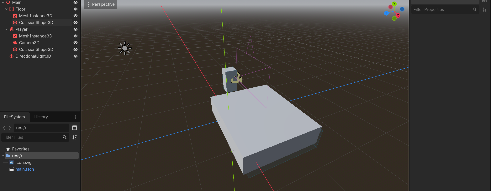
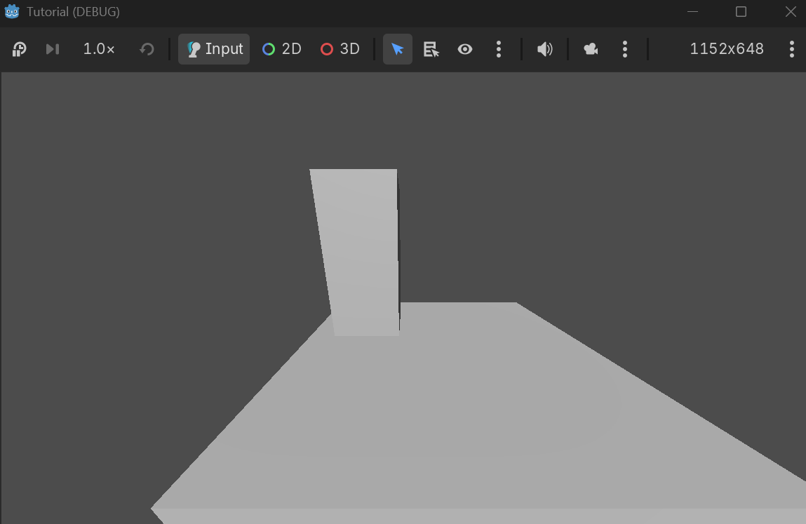

# 6. Using Input in a Game

Everything so far built the pipeline. Now we make it do something you can **see**: a small
3D game where your physical button and knob control the player. This is the payoff — real
hardware moving a real game character.

The game is minimal on purpose:

- **Button → jump**
- **Potentiometer → movement speed**

You will see the player walk faster or slower as you turn the knob, and leap when you
press the button.

## 6.1 Plan the scene

We need a small 3D world: a floor, a player that can jump, and a light and camera so we
can see it. The scene tree will look like this:

```text
Main (Node3D)
├── Floor (StaticBody3D)
│   ├── MeshInstance3D
│   └── CollisionShape3D
├── Player (CharacterBody3D)
│   ├── MeshInstance3D
│   └── CollisionShape3D
├── DirectionalLight3D
└── Camera3D
```

> **Note:** If you have never built a 3D scene in Godot, the official
> [Your first 3D game](https://docs.godotengine.org/en/stable/getting_started/first_3d_game/index.html)
> tutorial is a great reference. We are doing the same kind of thing, but much smaller.

## 6.2 Build the scene

### Floor

1. In the **Scene** panel, click **New Scene** and choose a **Node3D** root. Rename it
   `Main`.
2. Add a **StaticBody3D** child, rename it `Floor`.
3. Add a **MeshInstance3D** child. In the **Inspector**, click the Mesh box and choose
   **New BoxMesh**. Set its size to about `20 x 0.5 x 20`.
4. Add a **CollisionShape3D** child to `Floor`. In the Inspector, choose **New BoxShape3D**
   and set its size to the same `20 x 0.5 x 20`.
5. Move the floor down so its top surface sits at y = 0 (set the Floor's Position Y to
   `-0.25`).

### Player

6. Add a **CharacterBody3D** child to `Main`, rename it `Player`.
7. Add a **MeshInstance3D** to `Player` with a **New BoxMesh** (size about `0.5 x 1 x
   0.5`). Move the mesh up by `0.5` on Y so the player's feet touch the ground.
8. Add a **CollisionShape3D** to `Player` with a **New BoxShape3D** of the same size,
   also offset by `0.5` on Y.
9. Set the Player's Position Y to `1` so it starts just above the floor.

### Light and camera

10. Add a **DirectionalLight3D** to `Main` and rotate it so it lights the scene (for
    example, rotation X = `-50°`, rotation Y = `-30°`).
11. Add a **Camera3D** to `Main`, positioned at roughly `(0, 6, 12)`, looking at the
    origin (rotation X about `-30°`).



## 6.3 The controller script

Now we combine everything: the serial manager, the parsing from
[Part 5](05-reading-controller-input.md), and the game logic.

Create a new script called `player_controller.gd` and paste this:

```gdscript
extends CharacterBody3D

var manager: GdSerialManager

var button_pressed: bool = false
var pot_value: int = 0

const GRAVITY: float = 20.0
const JUMP_VELOCITY: float = 8.0
const MAX_SPEED: float = 8.0

func _ready():
    manager = GdSerialManager.new()
    manager.data_received.connect(_on_data_received)

    if manager.open(
        "COM5",            # <-- change this to your port name
        9600,
        1000,
        GdSerialManager.MODE_LINE_BUFFERED
    ):
        print("Arduino connected!")
    else:
        print("Could not connect to Arduino!")

func _process(_delta):
    manager.poll_events()

func _physics_process(_delta):
    # Apply gravity.
    if not is_on_floor():
        velocity.y -= GRAVITY * _delta

    # Jump when the button is pressed and we are on the ground.
    if button_pressed and is_on_floor():
        velocity.y = JUMP_VELOCITY

    # The potentiometer controls forward speed.
    # Map the 0-1023 knob range onto 0..MAX_SPEED.
    var speed: float = float(pot_value) / 1023.0 * MAX_SPEED
    velocity.z = -speed

    move_and_slide()

func _on_data_received(port: String, data: PackedByteArray):
    var text = data.get_string_from_utf8().strip_edges()

    if text.begins_with("BUTTON:"):
        var value = text.split(":")[1]
        button_pressed = (value == "1")

    elif text.begins_with("POT:"):
        var value = text.split(":")[1]
        pot_value = int(value)
```

## 6.4 Attach and run

1. Attach `player_controller.gd` to the `Player` node (drag the script onto it, or use
   the attach icon).
2. Make sure the Arduino is running the program from Part 3, and that the Arduino IDE's
   Serial Monitor is **closed**.
3. Press **F5** to run the scene.

Now try it:

- **Turn the knob** and watch the player move forward faster or slower.
- **Press the button** and the player jumps.

If the player moves backward or you prefer it, change `velocity.z = -speed` to
`velocity.z = speed`.



## 6.5 What each part of the script does

### `_physics_process`

This runs every physics frame (60 times per second by default). Physics-related movement
must happen here rather than in `_process`, because Godot applies physics in this step.
See the official
[CharacterBody3D documentation](https://docs.godotengine.org/en/stable/classes/class_characterbody3d.html#class-characterbody3d).

### Gravity and `is_on_floor()`

`CharacterBody3D` tracks whether it is touching the floor. We subtract gravity from `y`
velocity every frame, and only allow a jump when we are actually on the floor. Otherwise
the player could "jump" in mid-air forever.

### `float(pot_value) / 1023.0 * MAX_SPEED`

This is a **map**: `pot_value` goes from 0 to 1023, and we want a speed from 0 to 8.
Dividing by 1023 turns the knob range into a fraction (0.0 to 1.0), then multiplying by
`MAX_SPEED` scales it up.

### `velocity.z = -speed` and `move_and_slide()`

`move_and_slide()` moves the player by `velocity` and handles collisions with the floor.
We push the speed into `velocity.z` so the player walks forward.

## 6.6 The full flow, end to end

Let's trace one complete cycle — the button press:

```text
you press the button
   -> Arduino reads digital pin 2 (LOW)
   -> Arduino sends "BUTTON:1"
   -> USB serial carries it to the computer
   -> GdSerialManager buffers the line and emits data_received
   -> GDScript parses it -> button_pressed = true
   -> _physics_process: velocity.y = JUMP_VELOCITY
   -> move_and_slide() makes the player leave the ground
```

And the knob:

```text
you turn the knob
   -> Arduino reads analog pin A0 (0..1023)
   -> Arduino sends "POT:512"
   -> ... same journey ...
   -> GDScript parses it -> pot_value = 512
   -> _physics_process: speed = 512/1023 * 8
   -> the player moves forward at that speed
```

That is the whole tutorial objective: **physical input → serial message → Godot receives →
GDScript interprets → game responds.**

## 6.7 Checklist before continuing

- [ ] The button makes the player jump.
- [ ] The knob changes the player's movement speed.
- [ ] You understand the full data path listed above.

You built a working hardware-controlled game. In
[Part 7: Practice](07-practice.md), there are two exercises to extend it and test what you
learned.

---

**Previous:** [5. Reading Controller Input](05-reading-controller-input.md) | **Next:** [7. Practice](07-practice.md)